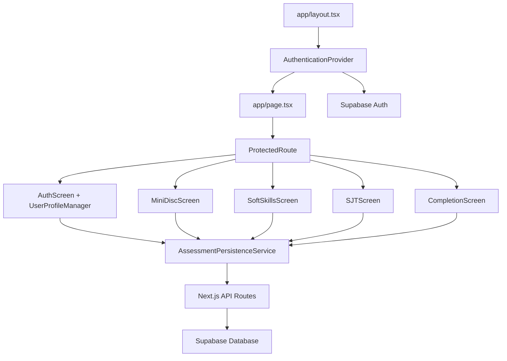

# Projeto Soyuz Architecture - Production Readiness Phase

## Introduction

This document outlines the architectural implementation of Projeto Soyuz's backend and authentication system using Supabase. **Epic 1 is 95% complete** - this document now serves as the architectural reference for production readiness, maintenance, and future development phases while documenting the successful brownfield enhancement.

**Relationship to Existing Architecture:**
This document supplements existing project architecture by defining how new components will integrate with current systems. Where conflicts arise between new and existing patterns, this document provides guidance on maintaining consistency while implementing enhancements.

### Existing Project Analysis

**Current Project State**
- **Primary Purpose:** Ferramenta de avaliação de soft skills para médicos implementada como aplicação Next.js frontend-only
- **Current Tech Stack:** Next.js 15.2.4, React 19, TypeScript 5, Tailwind CSS 4.1.9, Radix UI components
- **Architecture Style:** Next.js App Router com estrutura baseada em componentes React modulares
- **Deployment Method:** Configurado para Vercel com build otimizado

**Available Documentation**
- docs/PRD_brownfield.md - Comprehensive product requirements document
- docs/documentacao_inicial.md - Initial brownfield analysis and technical overview
- package.json - Dependencies and build configuration

**Identified Constraints**
- Perda de dados: Resultados perdidos ao fechar navegador - nenhuma persistência
- Ausência de autenticação: auth-screen.tsx apenas coleta dados básicos sem validação
- Estado volátil: Todo progresso da avaliação existe apenas na sessão atual
- Escalabilidade limitada: Arquitetura não suporta múltiplos usuários ou sessões concorrentes

### Change Log

| Change | Date | Version | Description | Author |
|--------|------|---------|-------------|--------|
| Initial Architecture | 2025-08-07 | 1.0 | Brownfield enhancement architecture for Supabase integration | Winston |
| Production Readiness Update | 2025-08-08 | 2.0 | Updated to reflect Epic 1 95% completion and production readiness focus | Winston |

## ✅ Implementation Status and Production Readiness

### Epic 1 Implementation Overview (95% Complete)
**Implementation Status:** ✅ **Authentication & Backend Successfully Implemented**
**Current Phase:** Production readiness and test stabilization (Story 1.8 critical)
**Remaining Work:** Test infrastructure stabilization (75 failing tests, coverage 43%→85%)

### Integration Approach
**Code Integration Strategy:** Integração incremental preservando componentes de UI existentes, adicionando layer de persistência através de Supabase SDK
**Database Integration:** PostgreSQL via Supabase com tabelas profiles e assessments conforme definido no PRD
**API Integration:** Next.js API Routes para endpoints RESTful (/api/assessment, /api/profile) com autenticação JWT
**UI Integration:** Refatoração mínima do auth-screen.tsx, mantendo design system Radix UI/Tailwind existente

### Compatibility Requirements
- **Existing API Compatibility:** N/A - Atualmente não há APIs, primeira implementação seguirá padrões RESTful
- **Database Schema Compatibility:** Estrutura nova baseada no PRD, sem conflitos com sistema atual
- **UI/UX Consistency:** Manter tema dark/light existente e padrões de navegação entre telas
- **Performance Impact:** Mínimo - Adição de <200ms para operações de banco devido à latência Supabase

## Tech Stack Alignment

### Existing Technology Stack
| Category | Current Technology | Version | Usage in Enhancement | Notes |
|----------|-------------------|---------|---------------------|--------|
| **Framework** | Next.js | 15.2.4 | API Routes para backend, manter App Router | Base sólida para full-stack |
| **Frontend** | React | 19 | Manter componentes existentes | Compatível com Supabase SDK |
| **Styling** | Tailwind CSS | 4.1.9 | Manter design system atual | Nenhuma mudança necessária |
| **UI Components** | Radix UI | latest | Preservar componentes de form/auth | Compatível com formulários Supabase |
| **TypeScript** | TypeScript | 5 | Tipagem para APIs e Supabase client | Essencial para type safety |
| **Build/Deploy** | Vercel | - | Manter deployment pipeline | Otimizado para Next.js + Supabase |

### New Technology Additions
| Technology | Version | Purpose | Rationale | Integration Method |
|-----------|---------|---------|-----------|-------------------|
| **Supabase JS SDK** | ^2.39.0 | Authentication & Database | Solução completa auth+DB, integração nativa Next.js | npm install + client setup |
| **Supabase Auth Helpers** | ^0.4.0 | SSR Auth para Next.js | Sessões seguras server-side | Server/Client separation |

## Data Models and Schema Changes

### New Data Models

#### Profile Model
**Purpose:** Armazenar dados profissionais específicos de médicos, estendendo o sistema de auth padrão do Supabase
**Integration:** Relaciona-se com auth.users via Foreign Key, permitindo profile management separado da autenticação

**Key Attributes:**
- `id: UUID` - Chave primária referenciando auth.users(id)
- `name: TEXT NOT NULL` - Nome completo do médico
- `email: TEXT NOT NULL` - Email profissional (sincronizado com auth)
- `phone: TEXT` - Telefone de contato
- `crm: TEXT NOT NULL` - Registro profissional obrigatório
- `specialty: TEXT NOT NULL` - Especialidade médica
- `avatar_url: TEXT` - URL opcional para foto de perfil
- `created_at/updated_at: TIMESTAMPTZ` - Timestamps de auditoria

**Relationships:**
- **With Existing:** One-to-One com auth.users (Supabase managed)
- **With New:** One-to-Many com assessments

#### Assessment Model  
**Purpose:** Persistir resultados completos de avaliações comportamentais, mantendo histórico e permitindo análise longitudinal
**Integration:** Vincula-se ao usuário autenticado e preserva a estrutura JSON dos resultados existentes

**Key Attributes:**
- `id: UUID` - Chave primária gerada automaticamente
- `user_id: UUID NOT NULL` - Referência ao usuário autenticado
- `type: TEXT NOT NULL` - Tipo de avaliação ('complete', 'disc', 'soft_skills', 'sjt')
- `status: TEXT DEFAULT 'in_progress'` - Status da avaliação
- `disc_results: JSONB` - Resultados DISC preservando estrutura atual {D, I, S, C}
- `soft_skills_results: JSONB` - Resultados soft skills {comunicacao, lideranca, etc}
- `sjt_results: JSONB` - Resultados SJT como array de scores
- `created_at: TIMESTAMPTZ` - Início da avaliação
- `completed_at: TIMESTAMPTZ` - Conclusão da avaliação

**Relationships:**
- **With Existing:** Many-to-One com auth.users
- **With New:** Belongs-to Profile via user_id

### Schema Integration Strategy

**Database Changes Required:**
- **New Tables:** profiles, assessments
- **Modified Tables:** Nenhuma - sistema atual não possui BD
- **New Indexes:** idx_assessments_user_id, idx_assessments_created_at, idx_profiles_crm
- **Migration Strategy:** DDL scripts executados via Supabase Dashboard/CLI

**Backward Compatibility:**
- Sistema atual não possui persistência - compatibilidade garantida por design
- Estrutura JSON preserva formato exato dos resultados em memória atuais
- API endpoints novos não interferem com fluxo frontend existente

## Component Architecture

### New Components

#### AuthenticationProvider
**Responsibility:** Gerenciar estado global de autenticação e sessão do usuário através da aplicação
**Integration Points:** Wrapper de alto nível no layout.tsx, fornece contexto para todos os componentes filhos

**Key Interfaces:**
- `useAuth()` hook para acesso ao estado de auth
- `signIn(email, password)` função para login
- `signUp(userData)` função para registro
- `signOut()` função para logout

**Dependencies:**
- **Existing Components:** Integra com app/layout.tsx como provider
- **New Components:** Consumed by AuthScreen, ProtectedRoute
- **Technology Stack:** Supabase Auth SDK, React Context API

#### ProtectedRoute
**Responsibility:** Componente de ordem superior que protege rotas requerendo autenticação válida
**Integration Points:** Envolve componentes de avaliação (MiniDiscScreen, SoftSkillsScreen, SJTScreen)

**Key Interfaces:**
- `fallback` prop para componente de loading/redirect
- `redirectTo` prop para redirecionar usuários não autenticados

**Dependencies:**
- **Existing Components:** Protege MiniDiscScreen, SoftSkillsScreen, SJTScreen, CompletionScreen
- **New Components:** Usa AuthenticationProvider context
- **Technology Stack:** React, Next.js routing

#### AssessmentPersistenceService
**Responsibility:** Service layer para salvar e recuperar dados de avaliação do backend
**Integration Points:** Chamado pelos componentes de tela existentes para auto-save e recuperação de dados

**Key Interfaces:**
- `saveAssessment(assessmentData)` para persistir progresso
- `getAssessmentHistory()` para carregar histórico
- `updateAssessmentResults(id, results)` para atualizar resultados

**Dependencies:**
- **Existing Components:** Integra com page.tsx state management
- **New Components:** Usa AuthenticationProvider para user context
- **Technology Stack:** Supabase client, Next.js API routes

#### UserProfileManager
**Responsibility:** Gerenciar dados do perfil profissional do médico
**Integration Points:** Integra com AuthScreen existente para coleta e validação de dados profissionais

**Key Interfaces:**
- `createProfile(profileData)` para criação inicial
- `updateProfile(profileData)` para atualizações
- `validateCRM(crm)` para validação de registro médico

**Dependencies:**
- **Existing Components:** Refatora auth-screen.tsx existente
- **New Components:** Usa AuthenticationProvider e AssessmentPersistenceService
- **Technology Stack:** Supabase client, React Hook Form, Zod validation

### Component Interaction Diagram



## API Design and Integration

### API Integration Strategy
**API Integration Strategy:** REST API usando Next.js API Routes com padrão de recursos aninhados
**Authentication:** JWT tokens via Supabase Auth com middleware de validação em todas as rotas protegidas
**Versioning:** Sem versioning inicial - API interna simples, futuro suporte a /v1/ se necessário

### New API Endpoints

#### POST /api/assessment
- **Method:** POST
- **Endpoint:** /api/assessment
- **Purpose:** Criar nova avaliação ou salvar progresso de avaliação existente
- **Integration:** Integra com AssessmentPersistenceService e componentes de avaliação

**Request:**
```json
{
  "type": "complete",
  "status": "in_progress",
  "disc_results": { "D": 25, "I": 15, "S": 20, "C": 10 },
  "soft_skills_results": { "comunicacao": 85, "lideranca": 70 },
  "sjt_results": [1, 3, 2, 4, 1]
}
```

**Response:**
```json
{
  "id": "uuid-assessment-id",
  "status": "success",
  "message": "Assessment saved successfully"
}
```

#### GET /api/assessments
- **Method:** GET
- **Endpoint:** /api/assessments
- **Purpose:** Listar todas as avaliações do usuário autenticado com paginação
- **Integration:** Usado pelo dashboard para exibir histórico

**Request:** Query parameters para paginação
**Response:**
```json
{
  "assessments": [
    {
      "id": "uuid",
      "type": "complete",
      "status": "completed",
      "created_at": "2025-08-07T10:00:00Z",
      "completed_at": "2025-08-07T10:45:00Z"
    }
  ],
  "pagination": { "total": 10, "page": 1, "limit": 20 }
}
```

#### GET /api/assessment/:id
- **Method:** GET
- **Endpoint:** /api/assessment/:id
- **Purpose:** Recuperar avaliação específica com todos os resultados detalhados
- **Integration:** Usado para visualização de resultados históricos

**Response:**
```json
{
  "id": "uuid",
  "type": "complete",
  "status": "completed",
  "disc_results": { "D": 25, "I": 15, "S": 20, "C": 10 },
  "soft_skills_results": { "comunicacao": 85, "lideranca": 70 },
  "sjt_results": [1, 3, 2, 4, 1],
  "created_at": "2025-08-07T10:00:00Z",
  "completed_at": "2025-08-07T10:45:00Z"
}
```

#### PUT /api/profile
- **Method:** PUT
- **Endpoint:** /api/profile
- **Purpose:** Atualizar dados do perfil profissional do médico
- **Integration:** Usado pelo UserProfileManager para atualizações

**Request:**
```json
{
  "name": "Dr. João Silva",
  "phone": "+5511999999999",
  "crm": "CRM/SP 123456",
  "specialty": "Cardiologia"
}
```

**Response:**
```json
{
  "status": "success",
  "message": "Profile updated successfully",
  "profile": { "id": "uuid", "name": "Dr. João Silva" }
}
```

## Source Tree Integration

### Existing Project Structure
```plaintext
soyuzcinterface/
├── app/
│   ├── globals.css
│   ├── layout.tsx          # Root layout with ThemeProvider
│   └── page.tsx            # Main entry point with state management
├── components/
│   ├── ui/                 # shadcn/ui components (Radix UI)
│   ├── auth-screen.tsx     # Current simple auth form
│   ├── mini-disc-screen.tsx
│   ├── soft-skills-screen.tsx
│   ├── sjt-screen.tsx
│   └── completion-screen.tsx
├── lib/
│   └── utils.ts            # Utility functions
└── docs/
    ├── PRD_brownfield.md
    └── documentacao_inicial.md
```

### New File Organization
```plaintext
soyuzcinterface/
├── app/
│   ├── api/                           # New API routes
│   │   ├── assessment/
│   │   │   └── route.ts              # Assessment CRUD operations
│   │   ├── assessments/
│   │   │   └── route.ts              # List assessments
│   │   └── profile/
│   │       └── route.ts              # Profile management
│   ├── globals.css
│   ├── layout.tsx                     # Enhanced with AuthProvider
│   └── page.tsx                       # Enhanced with ProtectedRoute
├── components/
│   ├── ui/                           # Existing shadcn/ui components
│   ├── providers/                    # New providers folder
│   │   └── auth-provider.tsx         # Authentication context provider
│   ├── auth/                         # New auth components
│   │   ├── protected-route.tsx       # Route protection HOC
│   │   └── user-profile-manager.tsx  # Profile management component
│   ├── auth-screen.tsx               # Enhanced with Supabase auth
│   ├── mini-disc-screen.tsx          # Enhanced with auto-save
│   ├── soft-skills-screen.tsx        # Enhanced with auto-save
│   ├── sjt-screen.tsx                # Enhanced with auto-save
│   └── completion-screen.tsx         # Enhanced with persistence
├── lib/
│   ├── supabase/                     # New Supabase integration
│   │   ├── client.ts                 # Browser client
│   │   ├── server.ts                 # Server client for API routes
│   │   └── types.ts                  # TypeScript definitions
│   ├── services/                     # New services folder
│   │   └── assessment-service.ts     # Assessment persistence service
│   └── utils.ts                      # Existing utilities
└── docs/
    ├── PRD_brownfield.md
    ├── documentacao_inicial.md
    └── architecture.md               # This document
```

### Integration Guidelines
- **File Naming:** Manter convenção kebab-case existente para componentes e arquivos
- **Folder Organization:** Seguir padrão App Router do Next.js, agrupar por funcionalidade (auth/, providers/, services/)
- **Import/Export Patterns:** Manter imports absolutos com @ alias, exports nomeados para services e utilities

## Infrastructure and Deployment Integration

### Existing Infrastructure
**Current Deployment:** Vercel deployment otimizado para Next.js com builds automáticos
**Infrastructure Tools:** Vercel CLI, GitHub integration para CI/CD
**Environments:** Desenvolvimento local com next dev, produção via Vercel

### Enhancement Deployment Strategy
**Deployment Approach:** Manter pipeline Vercel existente, adicionar variáveis de ambiente para Supabase
**Infrastructure Changes:** 
- Adicionar projeto Supabase (desenvolvimento e produção)
- Configurar environment variables no Vercel
- Setup de SSL certificates automático via Vercel

**Pipeline Integration:** 
- GitHub webhooks mantidos para deployment automático
- Preview deployments para pull requests
- Environment variables sincronizadas entre dev/prod

### Rollback Strategy
**Rollback Method:** Rollback via Vercel dashboard ou CLI, database migrations revertíveis via Supabase
**Risk Mitigation:** 
- Feature flags para funcionalidades de auth (gradual rollout)
- Database backups automáticos diários no Supabase
- Monitoring de health checks para APIs

**Monitoring:** Vercel Analytics + Supabase Dashboard para métricas de performance e uso

## Coding Standards and Conventions

### Existing Standards Compliance
**Code Style:** TypeScript strict mode, ESLint configurado, Prettier para formatação
**Linting Rules:** Next.js recommended ESLint config com regras de acessibilidade
**Testing Patterns:** Nenhum framework de teste configurado atualmente
**Documentation Style:** JSDoc para funções complexas, README para setup

### Enhancement-Specific Standards
- **Supabase Client Usage:** Sempre usar server client para API routes, browser client apenas em componentes
- **Error Handling:** Padrão try/catch com logging estruturado para Supabase operations
- **Type Safety:** Definir interfaces TypeScript para todos os modelos de dados
- **Authentication Flow:** Sempre verificar sessão em API routes antes de operações de dados

### Critical Integration Rules
- **Existing API Compatibility:** N/A - primeira implementação de APIs
- **Database Integration:** Usar apenas Supabase client, nunca SQL direto
- **Error Handling:** Manter padrões de tratamento de erro existentes, adicionar Supabase error handling
- **Logging Consistency:** Console.log para desenvolvimento, considerar structured logging para produção

## Testing Strategy

### Integration with Existing Tests
**Existing Test Framework:** Nenhum configurado - primeira implementação de testes
**Test Organization:** Proposta de estrutura com __tests__ folders adjacentes aos arquivos
**Coverage Requirements:** Mínimo 70% para novas funcionalidades críticas (auth, APIs)

### New Testing Requirements

#### Unit Tests for New Components
- **Framework:** Jest + React Testing Library (padrão Next.js)
- **Location:** __tests__ folders co-localizados com components
- **Coverage Target:** 80% para AuthProvider, AssessmentService, API routes
- **Integration with Existing:** Setup inicial de Jest config para projeto

#### Integration Tests
- **Scope:** Fluxos completos de auth (login/logout), salvamento de avaliações
- **Existing System Verification:** Garantir que componentes de avaliação existentes funcionam com novo backend
- **New Feature Testing:** Testes E2E para fluxos de cadastro e persistência de dados

#### Regression Tests
- **Existing Feature Verification:** Testes automatizados para garantir que avaliações DISC/Soft Skills/SJT continuam funcionando
- **Automated Regression Suite:** GitHub Actions workflow para executar testes em PRs
- **Manual Testing Requirements:** Checklist de QA para testar fluxos críticos antes de releases

## Security Integration

### Existing Security Measures
**Authentication:** Atualmente inexistente - implementação inicial com Supabase Auth
**Authorization:** N/A - será implementado com RLS (Row Level Security) no Supabase
**Data Protection:** HTTPS via Vercel, será adicionada criptografia de dados sensíveis
**Security Tools:** ESLint security rules, será adicionado Supabase security scanning

### Enhancement Security Requirements
**New Security Measures:**
- JWT token validation em todas as API routes
- Row Level Security policies no Supabase para isolamento de dados por usuário
- Rate limiting básico em endpoints críticos
- Input validation com Zod schemas

**Integration Points:** 
- Middleware de autenticação para API routes
- Client-side auth state management seguro
- Secure cookie configuration para sessões

**Compliance Requirements:** 
- LGPD compliance para dados médicos brasileiros
- Supabase SOC2 compliance herdada
- Audit trail para mudanças de dados sensíveis

### Security Testing
**Existing Security Tests:** Nenhum - primeira implementação
**New Security Test Requirements:** 
- Testes de autorização (usuários não podem acessar dados de outros)
- Validation testing para inputs maliciosos
- Session management testing (logout adequado, token expiration)

**Penetration Testing:** Não necessário para MVP, considerar para futuras versões com mais usuários

## 🚨 Test Infrastructure Stabilization (Critical - Story 1.8)

### Current Testing Crisis Status
**Critical Issue:** 75 individual tests failing, 12 test suites failing, coverage at 43% (target: 85%)
**Production Impact:** Deployment blocked until test infrastructure is stabilized
**Priority:** CRITICAL - Epic 1 completion blocker

### Test Failure Analysis Required
**Systematic Approach for Test Stabilization:**
1. **Diagnostic Phase**: Identify root causes of the 75 failing tests
   - Categorize failures: auth-related, database-related, component-related, integration-related
   - Map failing tests to implemented components (AuthProvider, AssessmentService, API routes)
   - Document dependency issues between test suites

2. **Infrastructure Issues**: Address underlying test environment problems
   - Supabase test database connection and seeding
   - Authentication mocking for test environments  
   - API route testing setup and environment variables
   - Component testing with Supabase client dependencies

### Test Architecture Requirements

#### Unit Test Stabilization
- **AuthenticationProvider Tests**: Ensure proper mocking of Supabase Auth
- **AssessmentService Tests**: Mock Supabase client for database operations
- **API Route Tests**: Test with proper authentication context and database mocking
- **Component Tests**: Isolate UI components from backend dependencies

#### Integration Test Framework
- **Database Integration**: Proper test database setup and teardown
- **Authentication Flow**: End-to-end auth testing with real Supabase test project
- **API Integration**: Request/response cycle testing with authentication
- **Cross-component Integration**: Assessment flow with persistence

#### Coverage Improvement Strategy (43% → 85%)
**Systematic Coverage Approach:**
1. **Critical Path Coverage**: Focus on auth, data persistence, and assessment flows
2. **Component Coverage**: Ensure all major components have comprehensive tests
3. **Error Path Coverage**: Test error handling and edge cases
4. **API Coverage**: Full endpoint testing with various scenarios

### Implementation Guidance for Test Stabilization

#### Test Environment Setup
```typescript
// Supabase Test Configuration
const supabaseTestConfig = {
  url: process.env.NEXT_PUBLIC_SUPABASE_TEST_URL,
  anonKey: process.env.NEXT_PUBLIC_SUPABASE_TEST_ANON_KEY,
  // Isolated test database
}

// Test Database Seeding
const setupTestDatabase = async () => {
  // Create test users, profiles, assessments
  // Ensure clean state for each test run
}
```

#### Test Patterns for Supabase Integration
- **Mocking Strategy**: Use Supabase client mocks for unit tests
- **Test Database**: Dedicated test instance for integration tests  
- **Authentication Testing**: Mock auth context for component tests
- **Cleanup Strategy**: Proper test data cleanup after each test

### Success Criteria for Test Stabilization
- [ ] All 75 failing tests resolved and passing
- [ ] 12 failing test suites restored to passing state
- [ ] Test coverage improved from 43% to minimum 85%
- [ ] CI/CD pipeline stable with quality gates
- [ ] Production deployment unblocked

### Risk Mitigation During Test Fixes
- **Regression Prevention**: Ensure existing functionality remains intact
- **Performance Impact**: Monitor test execution time (target: <2 minutes full suite)
- **Documentation**: Document test patterns for future development
- **Monitoring**: Set up test failure alerts and reporting

## Next Steps - Production Readiness Focus

### ✅ Epic 1 Implementation Status (95% Complete)

**Successfully Implemented:**
✅ AuthenticationProvider and Supabase configuration (Story 1.1)
✅ User Profile Management system (Story 1.2) 
✅ Assessment Persistence with auto-save (Story 1.6 - 95%)
✅ API Routes and backend infrastructure (Stories 1.3, 1.6)
✅ UI integration preserving existing design system

**Current Critical Phase: Test Infrastructure Stabilization**

### Immediate Actions Required (Story 1.8 Critical)

**Priority 0: Test Stabilization (24-35 hours estimated)**
- Fix 75 failing individual tests blocking production
- Resolve 12 failing test suites 
- Improve coverage from 43% to 85% (architecture requirement)
- Stabilize CI/CD pipeline with quality gates

**Story 1.8 Development Focus:**
Following the Test Infrastructure Stabilization section above, systematically address:
1. Diagnostic phase for test failures
2. Infrastructure fixes for test environment
3. Coverage improvement strategy
4. CI/CD pipeline stabilization

### Post-Test Stabilization (Story 1.6 Completion)

**Final Epic 1 Tasks (8-12 hours estimated):**
- Complete test coverage for Story 1.6 Assessment History System
- Final QA validation of all Epic 1 components
- Production deployment preparation

### Production Readiness Checklist

**Pre-deployment Validation:**
- [ ] All tests passing (0 failures)
- [ ] Test coverage ≥ 85% 
- [ ] CI/CD pipeline stable
- [ ] Performance benchmarks met (<200ms API responses)
- [ ] Security validation complete (JWT, RLS policies)
- [ ] Monitoring and alerting configured

### Developer Handoff - Test Stabilization Focus

**Current Mission: Resolve Test Infrastructure Crisis (Story 1.8)**

**System Status:** Epic 1 authentication and backend implementation 95% complete. Production deployment blocked by test infrastructure instability.

**Critical Task:** Fix 75 failing tests, improve coverage from 43% to 85%, stabilize CI/CD pipeline.

**Reference Documents:**
- docs/architecture.md - Section "Test Infrastructure Stabilization" for detailed guidance
- docs/PRD_brownfield.md - Updated with current implementation status
- docs/epics/epic-1-authentication-and-persistence.md - Current Epic 1 status

**Test Stabilization Approach:**
1. **Diagnostic Phase**: Analyze failing tests by category (auth, database, component, integration)
2. **Environment Setup**: Fix Supabase test database configuration and seeding
3. **Mocking Strategy**: Implement proper Supabase client mocks for unit tests  
4. **Coverage Improvement**: Systematic testing of auth flows, API endpoints, components
5. **Pipeline Stabilization**: Ensure consistent CI/CD execution

**Already Implemented and Working:**
✅ Supabase authentication and database integration
✅ AuthenticationProvider and session management
✅ API Routes for assessments and profiles  
✅ Assessment persistence and auto-save functionality
✅ UI components integration with backend

**DO NOT re-implement existing functionality.** Focus exclusively on test stabilization.

**Success Criteria:**
- All tests passing (0 failures)
- Coverage ≥ 85%
- CI/CD pipeline consistently green
- Production deployment unblocked

**Post-Test Stabilization:** Complete final 8-12 hours of Story 1.6 test coverage, then proceed to production deployment.

**Architecture Reference:** Use "Test Infrastructure Stabilization" section above for technical implementation patterns and environment setup.