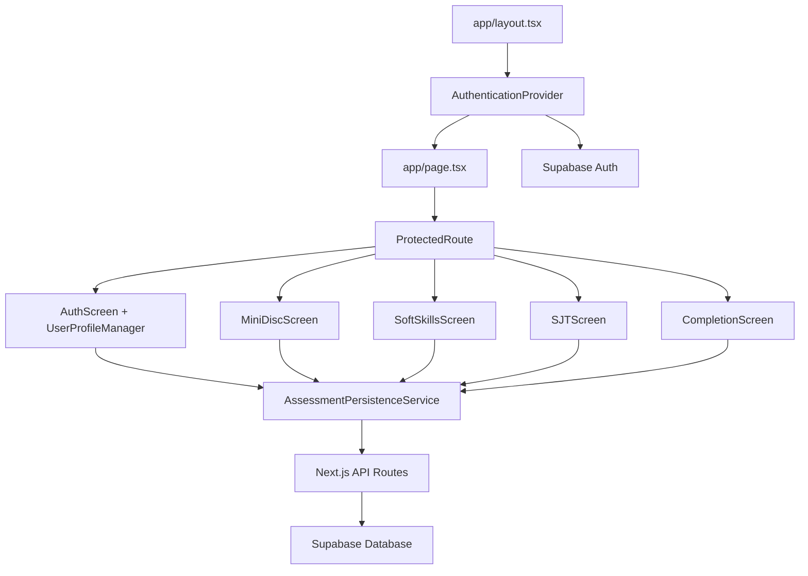

# Component Architecture

## New Components

### AuthenticationProvider
**Responsibility:** Gerenciar estado global de autenticação e sessão do usuário através da aplicação
**Integration Points:** Wrapper de alto nível no layout.tsx, fornece contexto para todos os componentes filhos

**Key Interfaces:**
- `useAuth()` hook para acesso ao estado de auth
- `signIn(email, password)` função para login
- `signUp(userData)` função para registro
- `signOut()` função para logout

**Dependencies:**
- **Existing Components:** Integra com app/layout.tsx como provider
- **New Components:** Consumed by AuthScreen, ProtectedRoute
- **Technology Stack:** Supabase Auth SDK, React Context API

### ProtectedRoute
**Responsibility:** Componente de ordem superior que protege rotas requerendo autenticação válida
**Integration Points:** Envolve componentes de avaliação (MiniDiscScreen, SoftSkillsScreen, SJTScreen)

**Key Interfaces:**
- `fallback` prop para componente de loading/redirect
- `redirectTo` prop para redirecionar usuários não autenticados

**Dependencies:**
- **Existing Components:** Protege MiniDiscScreen, SoftSkillsScreen, SJTScreen, CompletionScreen
- **New Components:** Usa AuthenticationProvider context
- **Technology Stack:** React, Next.js routing

### AssessmentPersistenceService
**Responsibility:** Service layer para salvar e recuperar dados de avaliação do backend
**Integration Points:** Chamado pelos componentes de tela existentes para auto-save e recuperação de dados

**Key Interfaces:**
- `saveAssessment(assessmentData)` para persistir progresso
- `getAssessmentHistory()` para carregar histórico
- `updateAssessmentResults(id, results)` para atualizar resultados

**Dependencies:**
- **Existing Components:** Integra com page.tsx state management
- **New Components:** Usa AuthenticationProvider para user context
- **Technology Stack:** Supabase client, Next.js API routes

### UserProfileManager
**Responsibility:** Gerenciar dados do perfil profissional do médico
**Integration Points:** Integra com AuthScreen existente para coleta e validação de dados profissionais

**Key Interfaces:**
- `createProfile(profileData)` para criação inicial
- `updateProfile(profileData)` para atualizações
- `validateCRM(crm)` para validação de registro médico

**Dependencies:**
- **Existing Components:** Refatora auth-screen.tsx existente
- **New Components:** Usa AuthenticationProvider e AssessmentPersistenceService
- **Technology Stack:** Supabase client, React Hook Form, Zod validation

## Component Interaction Diagram

